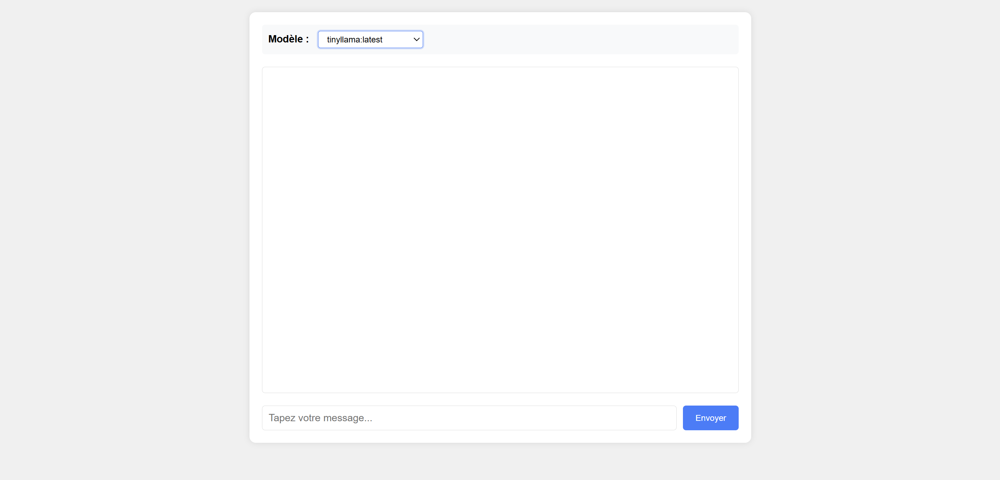

Voici un **README.md** complet pour votre projet, incluant une illustration et toutes les informations nécessaires pour son utilisation et son déploiement :

---

# Chat Interface with Ollama Models



---

## 📝 Description

Ce projet est une interface web pour interagir avec des modèles de langage hébergés localement. 

Il permet de :
   - Choisir parmi plusieurs modèles disponibles (ex: TinyLlama, Llama2, etc.).
   - Dialoguer en temps réel avec le modèle sélectionné.
   - Sauvegarder la conversation en session pendant 1 heure.
   - Afficher les réponses en streaming pour une expérience fluide.

---

## 🚀 Fonctionnalités

- **Sélection de modèle** : Choisissez parmi les modèles disponibles sur votre instance Ollama.
- **Conversation persistante** : La conversation est sauvegardée en session pendant 1 heure.
- **Streaming des réponses** : Les réponses du modèle sont affichées en temps réel.
- **Interface intuitive** : Design moderne et réactif.
- **Gestion des erreurs** : Messages d'erreur clairs en cas de problème.

---

## 🛠️ Installation

### Prérequis

- PHP 8.0 ou supérieur
- Ollama installé et configuré localement
- Un navigateur web moderne

### Étapes d'installation

1. **Cloner le dépôt :**
   ```bash
   git clone https://github.com:Dupy007/ollamachatui.git
   cd ollamachatui
   ```

2. **Démarrer Ollama :**
   Assurez-vous qu'Ollama est en cours d'exécution :
   ```bash
   ollama serve
   ```

3. **Démarrer le serveur PHP :**
   ```bash
   php -S localhost:8000
   ```

4. **Accéder à l'interface :**
   Ouvrez votre navigateur et accédez à :
   ```
   http://localhost:8000
   ```

---

## 🖥️ Utilisation

1. **Sélectionnez un modèle** dans le menu déroulant en haut de l'interface.
2. **Tapez votre message** dans la zone de texte et appuyez sur Entrée ou cliquez sur "Envoyer".
3. **Observez la réponse** du modèle en temps réel.
4. **L'historique** de la conversation est automatiquement sauvegardé pendant 1 heure.

---

## 🧩 Structure du projet

```
ollamachatui/
├── index.php          # Interface principale
├── api.php            # Backend pour les requêtes Ollama
├── get_models.php     # Récupère la liste des modèles disponibles
├── set_model.php      # Change le modèle sélectionné
├── style.css          # Feuille de style
├── script.js          # Script JavaScript pour l'interactivité
└── README.md          # Ce fichier
```

---

## ⚙️ Configuration

### Variables d'environnement

Vous pouvez configurer le projet via des variables d'environnement :

```bash
export OLLAMA_HOST="http://localhost:11434"
export OLLAMA_ORIGINS="*"
export PHP_MAX_EXECUTION_TIME=600
```

### Options avancées

- **Changer le port PHP** :
  ```bash
  php -S localhost:8080
  ```

- **Modifier le timeout de session** :
  Dans `api.php`, modifiez :
  ```php
  if (time() - $lastActivity > 3600) { // 3600 secondes = 1 heure
  ```

---

## 🐛 Dépannage

### Erreurs courantes

1. **Modèle non disponible** :
   - Vérifiez que le modèle est bien téléchargé :
     ```bash
     ollama list
     ```
   - Si nécessaire, téléchargez-le :
     ```bash
     ollama pull tinyllama
     ```

2. **Problèmes de connexion** :
   - Vérifiez qu'Ollama est en cours d'exécution :
     ```bash
     curl http://localhost:11434/api/tags
     ```

3. **Timeout PHP** :
   - Augmentez le temps d'exécution maximum dans `api.php` :
     ```php
     set_time_limit(600); // 10 minutes
     ```

---

## 📄 Licence

Ce projet est sous licence MIT. Voir le fichier [LICENSE](LICENSE) pour plus de détails.

---

## 🙏 Contribution

Les contributions sont les bienvenues !

---

## 📸 Capture d'écran


---
